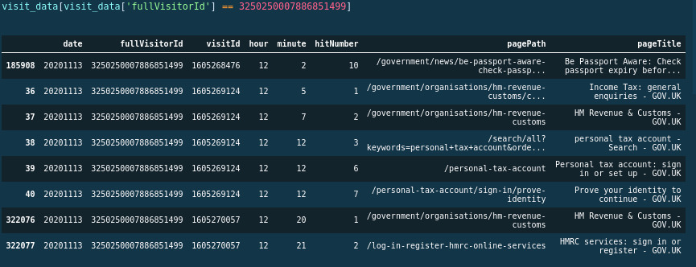
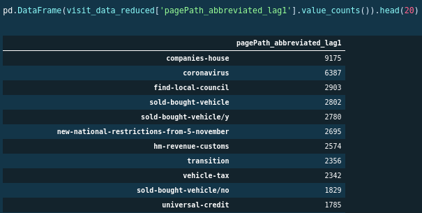
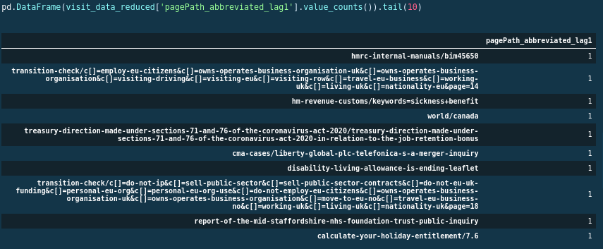
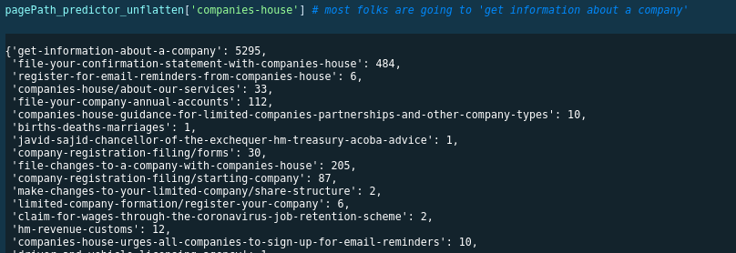
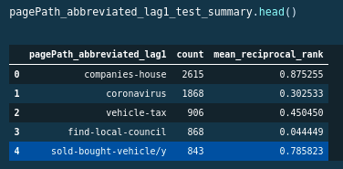

# Investigating relationships between successive URLs

## Predictable relationships between consecutive URLs 

The hypothesis is that there is no relationship between the sequences of government GOVUK website URLs visited by a user. Clicks are essentially randomly distributed, according to their availability. There is a natural degree of accuracy, of a naive prediction, just due the layout of the government website.

In summary:

- there is a [65%] chance that the next URL will be found in the next [10] recommended URLs
- the Mean Reciprocal Rank (MRR) for the predictions is [0.43] on a holdout test set

These results should not be regarded in terms of good or bad, rather they just establish a reference score. This serves as a benchmark to be beaten in future tailored predictions, which incorporate additional explanatory data regarding the user. This enables meaningful discussion and development of future models. These measures should be seen as the naiive or random prediction threshold. Any future models should be better than this measure.  

## Data used

The data used in the analysis is pulled from a single hour of usage (midday) of the GovUK website on 2020-11-13. This contains 844k unique records. As can be seen beneath, for a single `fullVisitorId`, there can be multiple values for `visitId`. It relates to hits which are classified as `PAGE`.

## Illustration of data

As seen, pagePath represents the URL visited.

## Rationale for considering only the preceding website

Typically in time series processes, the most important data point is the current one, in determining the next data point. In a memoryless process, the only data point which is relevant is the current one and the following data point will be a random jump to one of the connected points in the space. In the context of the GovUK website, it is frequently the case that a visitor can only visit the next URL via the current URL.

### Conditioning on time

As we are focussing on the single hour of data, we have implicitly conditioned on time. Different  predictions would be made for different slices of time. This would mean that this approach could incoporate non-stationary effects and the impact of current events. As will be discussed beneath, the model could be run in real time, as it is effectively relying on aggregations and dictionary data access which is inherently fast.

### Conditioning on location

Location is not considered here, but would be possible given that there is information about geolocation of the user. This simply requires consideration of aggregation weights as a function of distance, discounting information from users further away.

## Preparing the lagged data

The data requires a lagged URL to be created in order to see the link between current and past data. We are trying to predict the URL to be visited, by referencing the lagged URL.

Of note, a full 53% of the users on the government website only visit one link. This makes it impossible to create a lagged URL. These users data are removed from the dataset, as we cannot build a prediction conditioned on the past, as there is no history for the user.

### Removing login, search and done activity

Any URLs for search or login are removed. Search activity only accounts for [4%] of the remaining data, which when considered in combination with the number of users who only visit one URL, is indicative of external search engines.

Login activity, [6%] of the data, was removed as its a deterministic intermediate link to certain URLs, ie the probability of `P(a->login->b)` is the same as `P(a->b)`, as `P(login->b)` is 100%. Which in turn would mean that it obscures the relationship `P(a -> b)`. This admittedly ignores the losses from people who forget their login details.

Done activity was also removed, approximately a further [1%] of the data. The rationale for removing done activity was that it just represents the completion of an activity or form and is not helping the user access information.

### Circular journeys

Where the next URL is the same as the preceding URL, the data is removed.

### Aggregated data - top sites

### Aggregated data - some low count sites

As seen, some sites have only one single visit in the data. There are 34k unique URLs in the data, in the end.

## Model build

### Train test split

In order to build the model, the data is split using stratified sampling, so that 70% of users are in the train data, and the remainder in the test. No consideration was made for the actual time. This means that higher frequency effects than a one hour period are being ignored.

The model is based on the aggregation of data in the train data set. Using dicionary data structures, and then ranking the likely next URL based on the counts in the dictionary. The dictionary key could be considered to be a tuple of (current_URL, next_URL), although a nested dictionary structure is used, so that we have `{current_URL:{next_URL:count}}`. Although simple, this kind of cross tabulation captures interactions between fields and could be used recursively.

A particular advantage of this structure is that it easily handles the high cardinality of the data (many different potential values for the target). It can also be built online.

### Scoring test data

In order to get the rank of an observation in the test data, the tuple from the test data looks up the rank in the train data.

In practice, if this solution was deployed, the first part of the tuple key would be used (ie the current page), and the top [10] predictions would be returned as a list of `key:value` pairs.

### Illustration of train dictionary using Companies House

The most popular URL is for Companies House. This is a view of the dictionary of links for Companies House. Due to the dictionary structure, the entries are not sorted by value. The values represent the count of frequency of the second part of the key in the train dataset. In this example, the most popular link is to `get-information-about-a-company`.

### Illustration of results by parent URL

In the test set, we can aggregate by the parent URL, and find the mean reciprocal rank overall. As can be seen the results vary widely by the parent URL. The mean reciprocal rank for the companies house URL is very high, nearly 1, which reflects the dominance shown above in the category `get-information-about-a-company`.

In the same way someone should not be impressed with 50% accuracy in coin toss predictions, we should not be impressed with these results. We have just quantified the natural ease of predicting the next link on GOVUK.

In contrast to the results for the `companies-house` URL, we see that the predictive performance of 'find-local-council` is poor. This reflects the high cardinality of the potential child URL. This would be partially remedied by the inclusion of location in the explanatory data.

## Final words

The predictive power of the model should be seen as establishing an initial benchmark for the mean reciprocal rank (MRR). Other data should be included, most likely location and then ideally user specific information such as other URL activity over preceding sessions. In turn, the URL activity from previous sessions could be expressed by translating the related content into document vectors, for example using the average of the sentence embeddings, and including dwell times to weight the content. The benefit of additional data needs to be weighed up against the cost of acquiring the data and managing the computational environment necessary to process the data.

## Additional questions

Q. Is this not a simple tabulation of what has happened previously, to predict the future, with no regard to the user?

A. Yes, this is simply aggregating results and ordering URLs by the measure `P(new_URL|current_URL, current_time)`. We can make this more nuanced by using a tighter definition of the data we are conditioning on. For example, location and device are a good start, as these are immediately available. 

The impact of personalisation, via addition of user specific data, should be measured against this benchmark. This then enables a cost benefit analysis (CBA) of the effort to record, store, recall and process user data, in the name of personalisation.
